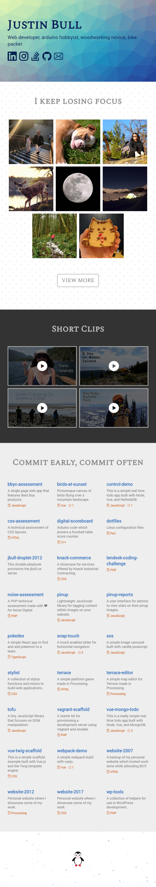

# Website 2017

Personal website where I showcase some of my work.

## Prerequisites

[Node.js](https://nodejs.org/en/download/) JavaScript runtime built on Chrome's V8 JavaScript engine.

```bash
sudo apt-get install nodejs
sudo pacman -S nodejs
```

[Composer](https://getcomposer.org/download/) Dependency Manager for PHP.

```bash
sudo apt-get install composer
sudo pacman -S composer
```

[Vagrant](https://www.vagrantup.com/downloads.html) Build portable virtual environments.

```bash
sudo apt-get install vagrant
sudo pacman -S vagrant
```

[VirtualBox](https://www.virtualbox.org/wiki/Downloads) Hypervisor for x86 computers.

```bash
sudo apt-get install virtualbox
sudo pacman -S virtualbox
```

## How To Install

```bash
git clone git@github.com:jabes/website-2017.git
cd website-2017
npm install
composer install
vagrant box add laravel/homestead
vagrant plugin install vagrant-hostsupdater
vagrant up
```

## Production Server

This will bind to all available addresses `0.0.0.0` on port `80`.

1. First build from source `npm run build:prod`
2. Then run the http server `npm run server:prod`

## Development Server

The app will automatically reload if you change any of the source files.

1. Run `npm run server:dev` for a dev server
2. Navigate to `http://localhost:4200/`

## Update Github Pages Branch

There is probably a better solution than this but it works.
Delete the existing branch because updates are rejected otherwise.
Then push the public build folder to the new branch.
Make sure to set the custom domain setting on Github.
https://gist.github.com/cobyism/4730490

```bash
git branch -d gh-pages
git push origin --delete gh-pages
git subtree push --prefix public origin gh-pages
```

## Screenshots


