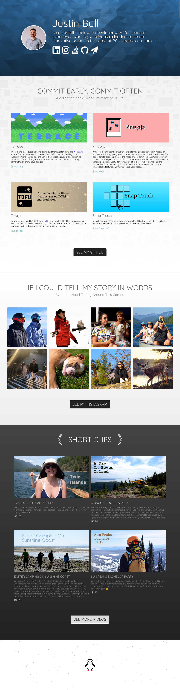

# Website 2017

Personal website where I showcase some of my work.

## Prerequisites

[Node.js](https://nodejs.org/en/download/) JavaScript runtime built on Chrome's V8 JavaScript engine.

```bash
# Debian
sudo apt install nodejs
# Arch
sudo pacman -S nodejs
```

## How To Install

```bash
git clone git@github.com:jabes/website-2017.git
cd website-2017
npm install
```

## Run Development Server

The app will automatically reload if you change any of the source files.

1. Run `npm run dev` to start the dev server.
2. Navigate to `http://localhost:4200/` in your browser.

## Deploy Updates

1. Run `npm run deploy` in your console to build and deploy changes to Github pages branch.

## Screenshots


